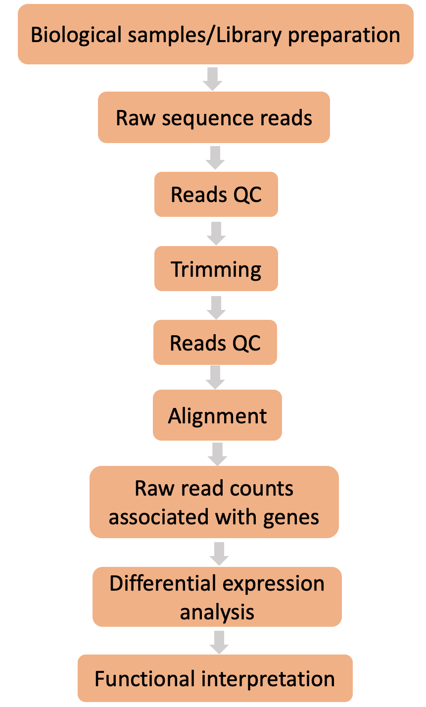

# **A typical differential expression (DE) analysis pipeline**

### **Questions**

- What are the different steps in a typical RNA-seq differential expression (DE) pipeline?

  

### **Objectives**

- Get familier with the RNA-seq DE analysis pipeline.

  

  The aim of our RNA-Seq experiment is to determine which genes are expressed at different levels between our conditions of interest - `WT` and `KO`. These genes can then be used to identify possible biological insights into our main question which is **do these expression changes relate to Williams-Beuren disease phenotype**.
  To do this, we will first look at the basic structure of a differential expression analysis pipeline. 

### **Challenge**
- Let's try and ask ourselves a question, how should a typlical RNA-seq differential expression (DE) pipeline look like?
- To assist, we have provided the basic processes as building blocks in the figure below. **But** these are placed in no particular order.
- Can you try and arrange them sequentially from Step (1) to Step (5). 

Solution

#### The basic steps in a differential expression (DE) pipeline
{width=50%}

**We will now discuss the above steps in more details with context to the `nf-core/rnaseq pipeline`**

  

### **Key points**

- Tools such as `FastQC` can be used for assessing the sequencing read-quality.
- `Trim galore` is one of the many tools available for read-trimming based on multiple criteria.
- We will use the aligner `STAR` to map the reads to the reference genome/transcriptome.
- The identification of statistically significant DE genes can be done using R libraries such as `DeSeq2`.

  

