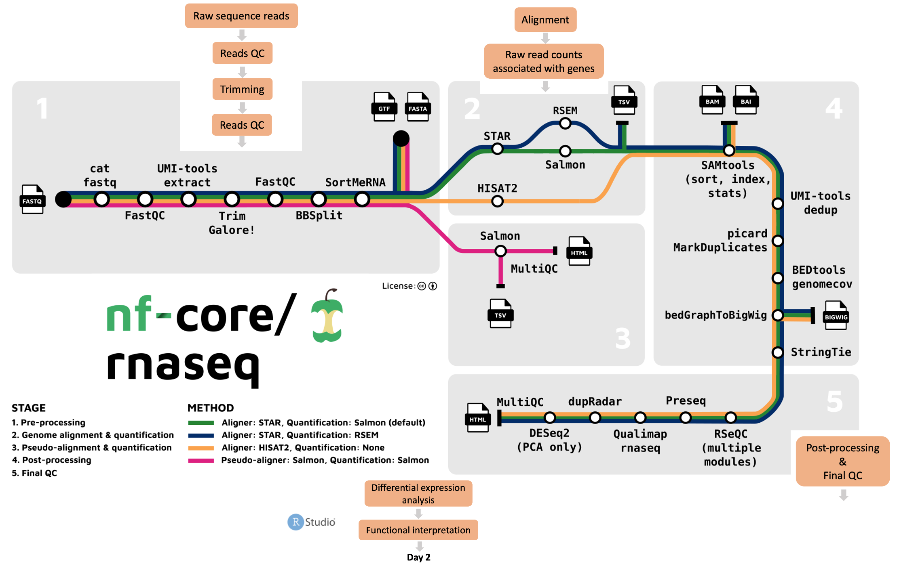

# **Introduction to nf-core/rnaseq**

### **Questions**{.unlisted}

- What processes does the nf-core/rnaseq pipeline perform? 
- What tools does the nf-core/rnaseq pipeline use? 
- Where can I run the nf-core/rnaseq pipeline? 

  
 

The nf-core/rnaseq pipeline can be used to analyse RNA sequencing data obtained from organisms with a reference genome and annotated gene dataset. It is built using [Nextflow](https://www.nextflow.io/) and is flexible and modular, allowing users to choose which processes to run and giving users the choice of different tools for essential steps like read alignment. 

## **What tools and processes does the pipeline run?**

Users can run their data through the whole pipeline with one command, or specific stages. The nf-core/rnaseq workflow comprises [5 stages](https://nf-co.re/rnaseq/3.8.1#pipeline-summary):

1. Raw data pre-processing and quality control using [FastQC](https://www.bioinformatics.babraham.ac.uk/projects/fastqc/), [MultiQC](http://multiqc.info/) and [Trim Galore!](https://www.bioinformatics.babraham.ac.uk/projects/trim_galore/)   
2. Genome alignment and quantification using a choice of [STAR](https://github.com/alexdobin/STAR), [RSEM](https://github.com/deweylab/RSEM), or [HISAT2](https://ccb.jhu.edu/software/hisat2/index.shtml)  
3. Pseudo-alignment and quantification with [Salmon](https://combine-lab.github.io/salmon/) 
4. Post-processing of aligned sequences including indexing, removal of duplicate reads, and transcript assembly and quantification 
5. Final quality control for evaluating alignment and quantification results.     

## **Where can I run the pipeline?**

Given Nextflow's focus on portability and reproducibility, the nf-core/rnaseq pipeline can be theoretically be run on any compute environment where you can install Nextflow and one of the software management tools like Singularity, Docker, and Conda among others. Take a look at their [installation guide](https://nf-co.re/docs/usage/installation#nextflow) for more details. 

Keep in mind that each of the tools the nf-core/rnaseq pipeline uses has its own minimum compute resource requirements. This means you'll need to make sure the environment you're working on has enough RAM and CPUs to process your data and disk space to store your raw data, intermediate files, and final results. Given how greedy these processes can be, we usually recommend you don't work on your personal computer. Today, we're working on [Pawsey's Nimbus cloud](https://support.pawsey.org.au/documentation/display/US/Nimbus+for+Bioinformatics) which is accessible to all Australian researchers. You might also consider other national high performance computing (HPC) platforms, your institution's HPC, as well as commercial cloud offerings. 

Take a look at this [Australian BioCommons webinar](https://www.youtube.com/watch?v=hNTbngSc-W0) if you'd like to learn more about understanding computing resources of bioinformatics analyses and how you can access the resources you need. 

[Proceed to the next lesson](https://sydney-informatics-hub.github.io/rna-seq-pt1-quarto/notebooks/2.2_nfcore-rnaseq_otherImportantParameters.html) by clicking on **Why use nf-core/rnaseq? > Customising nf-core/rnaseq** on the menu bar. 

### **Key points**{.unlisted}

- The nf-core/rnaseq pipeline is flexible and modular.
- The nf-core/rnaseq pipeline is portable and can be used on various platforms.

  
