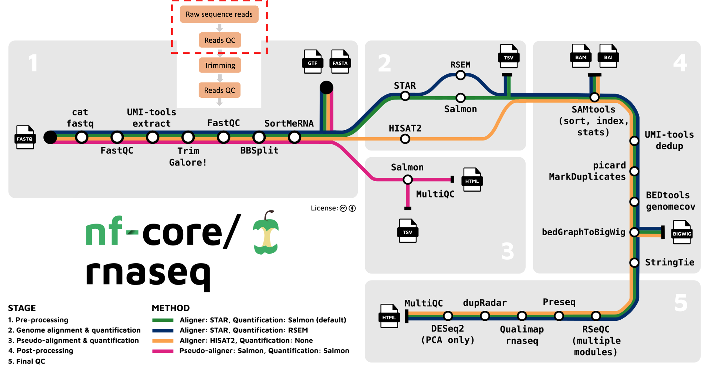

# **Raw sequence data quality control**

### **Questions**{.unlisted}

- What is the Fastq format?
- What are Phred quality scores?
- How can I evaluate the quality of my raw data using FastQC?

  

We're starting at the first stage of the nf-core/rnaseq workflow, specifically with raw sequence data (red box below). When your data is sequenced, it will be output in the fastq format by the sequencing machine. 

## Fastq format 
[Fastq](https://en.wikipedia.org/wiki/FASTQ_format) is a text-based format for storing both a biological sequence (usually nucleotide sequence) and it's corresponding quality score. Each entry in a fastq file will consist of 4 lines: 
1. A sequence identifier (label)
2. The nucleotide sequence 
3. A separator line, usually just a plus (+) sign 
4. The base call quality score per nucleotide. These are Phred scored, using ASCII characters. 

## **What are Phred quality scores?**

Phred quality scores are used to indicate the quality of a base call. The Phred score corresponds to the probability that the base was called correctly. Take a look at [GATK's explanation of Phred scores](https://gatk.broadinstitute.org/hc/en-us/articles/360035531872-Phred-scaled-quality-scores) for more information. 

## **What quality metrics can we evaluate with FastQC?**

[FastQC](https://www.bioinformatics.babraham.ac.uk/projects/fastqc/) is a popular tool used to evaluate fastq files. It provides a set of metrics which we can use to get a sense of whether our raw data has any problems that might impact our ability to analyse it downstream. For example, the image below is an example of the per base sequence quality plot that FastQC generates. In this example, we're looking at a dataset consisting of 101 bp reads. FastQC has looked at the Phred scores of all nucleotides across all reads and plot the distribution of Phred scores for each nucleotide position. 

Open up the results folder you downloaded to your computer and open the fastqc subdirectory. Take a look at the files ending in fastqc.html by opening them in a web browser and answering the challenge questions below: 

### **Challenge #1**{.unlisted}

1. How many sequences were in SRR3473989.fastq?
2. How long are the sequence reads in SRR3473989.fastq?

Solution

1. There are `59887` sequences in the file SRR3473989.fastq.
2. The reads in the file SRR3473989.fastq are of length `101 bp`.

  

### **Challenge #2**{.unlisted}

Looking at the **Per base sequence quality plot** for SRR3473989.fastq, answer the following questions.

1. Which part of the reads tend to have worse per base sequence quality? 
2. Do you think this dataset is of 'good' quality? Why or why not? 
3. Any suggestions to improve the quality of our raw reads? 

Solution

1. Reads which tend to have worse per base sequence quality are towards the right hand side (3' end).
2. The color coding separates out regions of good quality (Red PhredQ > 28) from the rest. Overall yes, as most of the regions of the reads show quality values in red.
3. We can trim the bases towards the 3'-end and hope to improve the overall read-quality. But trimming by quality for RNA-seq data has its pros and cons.

  

Once you've answered these questions, proceed to the next lesson which covers the next step run by the nf-core/rnaseq pipeline [What is nf-core/rnaseq doing? > Read trimming](). **GS- add links here once finalised** 

### Key points{.unlisted}
- Fastq is a standard format for sequencing reads.
- Phred Quality Scores are used to measure base qualities of sequencing reads. 
- FastQC can be used for evaluation. 

  