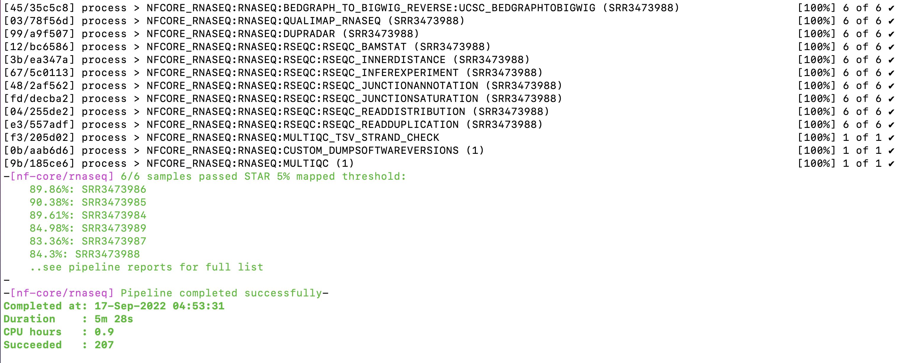

# **nf-core/rnaseq results folder**


<div class="questions">

### **Questions**
- How are the results from the nf-core/rnaseq organised?
- How to transfer the results from Pawsey Nimbus for interpretation? 
</div>  

<div class="objectives">

### **Objectives**
- Check if the nf-core/rnaseq command has run to completion
- Understand the structure of the results folder
- Transfer the required files from the results folder on Paqsey Nimbus to your local machine 
</div>  


### **Check if the nf-core/rnaseq command has completed**
-  Please check the terminal windows to see if your nfcore command has completed running without any erros. 
- You should see a screen similar to one shown below.   <br><br>


- The results of a completed run are stored in a folder `results` with sub-folders created for individual processes.

### **The `results` folder** 

Type the command 
```default
ls -lh results
``` 
to list the contents of the `results` folder.
 
```default
drwxrwxr-x  2 ubuntu ubuntu 4096 Jul 26 06:53 pipeline_info
drwxrwxr-x 19 ubuntu ubuntu 4096 Jul 26 06:53 star_salmon
drwxrwxr-x  3 ubuntu ubuntu 4096 Jul 26 06:44 trimgalore
drwxrwxr-x  2 ubuntu ubuntu 4096 Jul 26 06:43 fastqc
drwxrwxr-x  3 ubuntu ubuntu 4096 Jul 25 20:51 multiqc
```

### **Copy the `results` folder from Pawsey Nimbus to local machine**
- On your local machine, open a terminal.
- Navigate to the path of your choice using the command `cd` to `change the directory`.
- Use the following command for transferring the "results" folder from Pawsey Nimbus to this local path.

```default
scp -r `login_name`@###.###.###.###:~/base_directory/working_directory/results ./
```

- We can now use local browsers and other software tools such as `chrome` to open the html (and other) log files for further analysis.
- Next, we will try and uderstand the `results` generated by the `nf-core/rnaseq` pipeline with context to a **a typical differential expression (DE) analysis pipeline**.


<div class="keypoints">

### **Key points**
- The nf-core/rnaseq pipeline generates independant sub-folders in the main `results` folder for individual processes.
- The results can be transferred to the local machine and the files can be used for further analysis.  
</div>  
